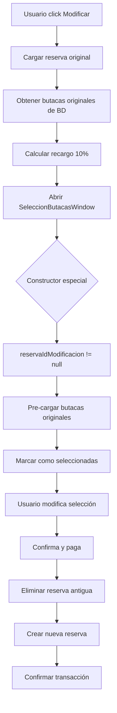

# ? Guía de Características Avanzadas - CineMax

Esta guía detalla las características avanzadas del sistema, su funcionamiento interno y cómo aprovecharlas al máximo.

## ?? Índice

1. [Sistema de Modificación de Reservas](#1-sistema-de-modificación-de-reservas)
2. [Pre-selección Inteligente de Butacas](#2-pre-selección-inteligente-de-butacas)
3. [Sistema de Recargos](#3-sistema-de-recargos)
4. [Búsqueda Avanzada de Reservas](#4-búsqueda-avanzada-de-reservas)
5. [Navegación con UserControls](#5-navegación-con-usercontrols)
6. [Visualización 3D de Butacas](#6-visualización-3d-de-butacas)
7. [Sistema de Pago Multi-método](#7-sistema-de-pago-multi-método)
8. [Gestión de Sesión Singleton](#8-gestión-de-sesión-singleton)

---

## 1. Sistema de Modificación de Reservas

### ?? Descripción
Permite a los usuarios modificar sus reservas existentes, cambiando las butacas seleccionadas sin perder su reserva original.

### ? Características
- ? Modificación fluida sin necesidad de cancelar y crear nueva reserva
- ? Pre-selección automática de butacas originales
- ? Cálculo automático de recargos
- ? Validación de disponibilidad en tiempo real
- ? Transacción segura (elimina antigua, crea nueva)

### ?? Funcionamiento Interno

#### Flujo Completo


#### Código Clave

**En PerfilUsuarioWindow.xaml.cs:**
```csharp
private async void BtnModificarReserva_Click(object sender, RoutedEventArgs e)
{
    var btn = sender as Button;
    var reserva = btn?.Tag as Reserva;
    
    if (reserva == null) return;
    
    // Validar que la sesión sea futura
    if (reserva.Sesion.FechaHora <= DateTime.Now)
    {
        MessageBox.Show("No se pueden modificar reservas de sesiones pasadas.");
        return;
    }
    
    // Calcular recargo (10% del total original)
    decimal recargo = reserva.Total * 0.10m;
    
    // Mostrar confirmación
    var resultado = MessageBox.Show(
        $"Modificar esta reserva tendrá un recargo de {recargo:F2} EUR.\n\n" +
        "¿Desea continuar?",
        "Confirmar Modificación",
        MessageBoxButton.YesNo,
        MessageBoxImage.Question
    );
    
    if (resultado == MessageBoxResult.No) return;
    
    // Abrir ventana de selección con parámetros especiales
    var butacasWindow = new SeleccionButacasWindow(
        reserva.Sesion!,
        reserva.Sesion.Pelicula!,
        reserva.Id,      // ? ID de reserva a modificar
        recargo          // ? Recargo a aplicar
    );
    
    var dialogResult = butacasWindow.ShowDialog();
    
    if (dialogResult == true)
    {
        // Eliminar reserva antigua
        await _dbService.EliminarReservaAsync(reserva.Id);
        
        // Recargar lista de reservas
        await CargarReservas();
        
        MessageBox.Show(
            "Reserva modificada exitosamente.\n\n" +
            $"Nuevo código: {/* nuevo código */}",
            "Modificación Exitosa",
            MessageBoxButton.OK,
            MessageBoxImage.Information
        );
    }
}
```

**En SeleccionButacasWindow.xaml.cs:**
```csharp
public SeleccionButacasWindow(
    Sesion sesion, 
    Pelicula pelicula, 
    int? reservaIdModificacion = null,
    decimal recargoModificacion = 0)
{
    InitializeComponent();
    _reservaIdModificacion = reservaIdModificacion;
    _recargoModificacion = recargoModificacion;
    // ... resto del constructor
}

private async Task CargarButacas()
{
    // ... código existente ...
    
    // Si es modificación, cargar butacas originales
    if (_reservaIdModificacion.HasValue)
    {
        // Obtener butacas de la reserva original
        var butacasOriginales = await _dbService
            .ObtenerButacasDeReservaConDetallesAsync(_reservaIdModificacion.Value);
        
        // Pre-seleccionar automáticamente
        _butacasSeleccionadas = butacasOriginales.ToList();
        
        // Almacenar IDs para referencia
        _butacasOriginalesReserva = butacasOriginales.Select(b => b.Id).ToList();
    }
    
    // Excluir butacas de esta reserva al obtener ocupadas
    _butacasOcupadas = await _dbService
        .ObtenerButacasReservadasAsync(_sesion.Id, _reservaIdModificacion);
    
    // ... resto del método
}
```

### ?? Ejemplo de Uso

**Escenario:** Usuario tiene reserva para "Oppenheimer" con butacas A1, A2, A3

1. Usuario va a "Mi Perfil" ? "Mis Reservas"
2. Click en "?? Modificar" de la reserva de Oppenheimer
3. Ve mensaje: "Modificar tendrá recargo de 2.85 EUR"
4. Acepta y abre ventana de butacas
5. Ve A1, A2, A3 **pre-seleccionadas en azul**
6. Decide cambiar: deselecciona A3, selecciona B1
7. Resumen muestra: A1, A2, B1 | Total: 28.50 EUR + 2.85 EUR = 31.35 EUR
8. Confirma y paga
9. Sistema:
   - Elimina reserva antigua (ID: 123)
   - Crea nueva reserva (ID: 456) con A1, A2, B1
   - Libera butaca A3
   - Reserva butaca B1
10. Usuario recibe nuevo código de reserva

---

## 2. Pre-selección Inteligente de Butacas

### ?? Descripción
Sistema que automáticamente selecciona las butacas que el usuario tenía reservadas originalmente al modificar una reserva.

### ? Características
- ? Carga automática de butacas originales desde BD
- ? Visualización diferenciada (azul = pre-seleccionada)
- ? Actualización automática del resumen
- ? Permite modificar la selección
- ? Mantiene consistencia visual

### ?? Implementación Técnica

```csharp
// 1. Propiedad para almacenar butacas originales
private List<int> _butacasOriginalesReserva = new();

// 2. Al cargar butacas, verificar si es modificación
if (_reservaIdModificacion.HasValue)
{
    // Obtener butacas de la BD
    var butacasOriginales = await _dbService
        .ObtenerButacasDeReservaConDetallesAsync(_reservaIdModificacion.Value);
    
    // Guardar IDs
    _butacasOriginalesReserva = butacasOriginales.Select(b => b.Id).ToList();
    
    // Pre-seleccionar (agregar a lista de seleccionadas)
    _butacasSeleccionadas = butacasOriginales.ToList();
}

// 3. Al crear botones, verificar si está pre-seleccionada
private Button CrearBotonButaca(Butaca butaca, int ancho, int alto)
{
    var btn = new Button { /* propiedades */ };
    
    bool estaOcupada = _butacasOcupadas.Contains(butaca.Id);
    bool estaPreseleccionada = _butacasSeleccionadas.Any(b => b.Id == butaca.Id);
    
    if (estaOcupada)
    {
        btn.Style = (Style)FindResource("ButacaOcupadaStyle");
    }
    else if (estaPreseleccionada)
    {
        // Mostrar como seleccionada (azul)
        btn.Style = (Style)FindResource("ButacaSeleccionadaStyle");
        btn.Click += BtnButaca_Click;  // Permitir deselección
    }
    else
    {
        // Estilo normal según tipo
        btn.Style = ObtenerEstiloPorTipo(butaca.Tipo);
        btn.Click += BtnButaca_Click;
    }
    
    return btn;
}

// 4. Actualizar resumen automáticamente
ActualizarResumen();  // Llamado después de pre-seleccionar
```

### ?? Estados Visuales

| Estado | Color | Descripción | Clickeable |
|--------|-------|-------------|------------|
| Disponible | ?? Verde | Butaca libre | ? |
| VIP Disponible | ?? Dorado | Butaca premium libre | ? |
| Discapacitado | ?? Morado | Butaca accesible | ? |
| Ocupada | ?? Rojo | Reservada por otro | ? |
| Pre-seleccionada | ?? Azul | Tu reserva original | ? |
| Seleccionada | ?? Azul | Selección actual | ? |

---

## 3. Sistema de Recargos

### ?? Descripción
Calcula y aplica automáticamente un recargo del 10% sobre el total original al modificar una reserva.

### ?? Cálculo de Recargos

```csharp
// Fórmula base
decimal recargoModificacion = totalOriginal * 0.10m;

// Ejemplo práctico:
// Total original: 28.50 EUR
// Recargo (10%): 2.85 EUR
// Nuevo total: Variable según nuevas butacas + 2.85 EUR
```

### ?? Ejemplos de Cálculo

#### Ejemplo 1: Mismo número de butacas
```
Original: 3 butacas normales = 3 × 9.50 = 28.50 EUR
Recargo: 28.50 × 0.10 = 2.85 EUR

Modificación: 3 butacas normales = 3 × 9.50 = 28.50 EUR
Total final: 28.50 + 2.85 = 31.35 EUR
```

#### Ejemplo 2: Cambio a VIP
```
Original: 3 butacas normales = 28.50 EUR
Recargo: 2.85 EUR

Modificación: 2 normales + 1 VIP = (2 × 9.50) + (1 × 12.50) = 31.50 EUR
Total final: 31.50 + 2.85 = 34.35 EUR
```

#### Ejemplo 3: Reducción de butacas
```
Original: 3 butacas = 28.50 EUR
Recargo: 2.85 EUR

Modificación: 2 butacas = 19.00 EUR
Total final: 19.00 + 2.85 = 21.85 EUR
(Menos que original pero con recargo)
```

### ?? Implementación

```csharp
// 1. Calcular recargo al modificar
decimal recargo = reservaOriginal.Total * 0.10m;

// 2. Pasar al constructor
new SeleccionButacasWindow(sesion, pelicula, reservaId, recargo);

// 3. Mostrar en UI
if (_recargoModificacion > 0)
{
    txtPrecioUnitario.Text = 
        $"Desde {_sesion.Precio:F2} EUR + Recargo modificación";
}

// 4. Incluir en total
decimal totalButacas = _butacasSeleccionadas.Sum(/* cálculo */);
decimal totalFinal = totalButacas + _recargoModificacion;

// 5. Mostrar desglose
if (_recargoModificacion > 0)
{
    txtTotal.Text = 
        $"{totalFinal:F2} EUR (incluye {_recargoModificacion:F2} EUR de recargo)";
}
```

### ? Ventajas del Sistema
- Incentiva decisiones más cuidadosas
- Compensa costos administrativos
- Transparente para el usuario
- Automático y configurable

---

## 4. Búsqueda Avanzada de Reservas

### ?? Descripción
Sistema de búsqueda en tiempo real que filtra reservas por código o nombre de película.

### ? Características
- ? Búsqueda instantánea (sin botón de buscar)
- ? Filtra por múltiples criterios
- ? Búsqueda case-insensitive
- ? Botón de limpiar búsqueda
- ? Mantiene todas las reservas en memoria

### ?? Criterios de Búsqueda

| Campo | Ejemplo | Coincidencia |
|-------|---------|--------------|
| Código completo | `RES20241206123456` | Exacta |
| Código parcial | `RES2024` | Contiene |
| Nombre película | `Oppenheimer` | Contiene |
| Parte del nombre | `Spider` | Contiene |

### ?? Implementación

```csharp
// En PerfilUsuarioWindow.xaml.cs

private List<Reserva> _todasLasReservas = new();  // Cache de reservas
private List<Reserva> _reservasFiltradas = new();  // Resultados de búsqueda

private void TxtBuscarReserva_TextChanged(object sender, TextChangedEventArgs e)
{
    string textoBusqueda = txtBuscarReserva.Text.Trim().ToLower();
    
    if (string.IsNullOrWhiteSpace(textoBusqueda))
    {
        // Sin búsqueda, mostrar todas
        _reservasFiltradas = _todasLasReservas;
        MostrarResultados(_reservasFiltradas);
        return;
    }
    
    // Filtrar por código o película
    _reservasFiltradas = _todasLasReservas.Where(r =>
        r.CodigoReserva?.ToLower().Contains(textoBusqueda) == true ||
        r.Sesion?.Pelicula?.Titulo?.ToLower().Contains(textoBusqueda) == true
    ).ToList();
    
    MostrarResultados(_reservasFiltradas);
}

private void MostrarResultados(List<Reserva> reservas)
{
    if (reservas.Count == 0)
    {
        // Mostrar mensaje "sin resultados"
        pnlSinResultados.Visibility = Visibility.Visible;
        itemsReservas.Visibility = Visibility.Collapsed;
        txtBusqueda.Text = $"No se encontraron reservas para '{txtBuscarReserva.Text}'";
    }
    else
    {
        // Mostrar resultados
        pnlSinResultados.Visibility = Visibility.Collapsed;
        itemsReservas.Visibility = Visibility.Visible;
        itemsReservas.ItemsSource = ConvertirAViewModels(reservas);
    }
}

private void BtnLimpiarBusqueda_Click(object sender, RoutedEventArgs e)
{
    txtBuscarReserva.Clear();
    _reservasFiltradas = _todasLasReservas;
    MostrarResultados(_reservasFiltradas);
}
```

### ?? UI de Búsqueda

```xml
<TextBox x:Name="txtBuscarReserva"
         Text="{Binding SearchText, UpdateSourceTrigger=PropertyChanged}"
         TextChanged="TxtBuscarReserva_TextChanged"
         PlaceholderText="?? Buscar por código o película..."/>

<Button x:Name="btnLimpiarBusqueda"
        Content="?"
        Click="BtnLimpiarBusqueda_Click"
        Visibility="{Binding HasSearchText}"/>
```

---

## 5. Navegación con UserControls

### ?? Descripción
Sistema moderno de navegación que mantiene MainWindow abierto y cambia dinámicamente el contenido mediante UserControls.

### ? Ventajas
- ? Sin cerrar/abrir ventanas constantemente
- ? Transiciones más fluidas
- ? Mejor rendimiento
- ? Estado persistente de MainWindow
- ? Código más mantenible

### ??? Arquitectura

```
MainWindow.xaml
?
??? ContentControl (MainContent)
?   ?
?   ??? CarteleraView (UserControl)
?   ?   ??? Grid de películas
?   ?
?   ??? SeleccionSesionView (UserControl)
?       ??? Info de película
?       ??? Calendario
?       ??? Lista de sesiones
?
??? Ventanas Modales (cuando sea necesario)
    ??? LoginWindow
    ??? SeleccionButacasWindow
    ??? PagoWindow
    ??? PerfilUsuarioWindow
```

### ?? Implementación

**MainWindow.xaml:**
```xml
<Window x:Class="Cine_app.Ventanas.MainWindow">
    <Grid>
        <!-- Contenedor principal -->
        <ContentControl x:Name="MainContent"/>
    </Grid>
</Window>
```

**MainWindow.xaml.cs:**
```csharp
private void MostrarCartelera()
{
    var carteleraView = new CarteleraView();
    carteleraView.PeliculaSeleccionada += (s, pelicula) =>
    {
        MostrarSeleccionSesion(pelicula);
    };
    MainContent.Content = carteleraView;
}

private void MostrarSeleccionSesion(Pelicula pelicula)
{
    var sesionView = new SeleccionSesionView();
    sesionView.CargarPelicula(pelicula);
    
    sesionView.Volver += (s, e) =>
    {
        MostrarCartelera();
    };
    
    sesionView.SesionSeleccionada += (s, datos) =>
    {
        AbrirSeleccionButacas(datos.sesion, datos.pelicula);
    };
    
    MainContent.Content = sesionView;
}
```

### ?? Transiciones

Para agregar transiciones animadas:
```xml
<ContentControl x:Name="MainContent">
    <ContentControl.Resources>
        <Storyboard x:Key="FadeIn">
            <DoubleAnimation Storyboard.TargetProperty="Opacity"
                           From="0" To="1" Duration="0:0:0.3"/>
        </Storyboard>
    </ContentControl.Resources>
</ContentControl>
```

---

## 6. Visualización 3D de Butacas

### ?? Descripción
Sistema avanzado de renderizado de butacas que simula perspectiva 3D con efecto de profundidad.

### ? Características
- ? Efecto de perspectiva (filas lejanas más grandes)
- ? Efecto de cono (espaciado lateral progresivo)
- ? Pasillo central automático
- ? Etiquetas de fila en ambos lados
- ? Tamaños proporcionales

### ?? Algoritmos

#### 1. Factor de Tamaño (Perspectiva)
```csharp
// Las filas traseras se ven más grandes (efecto de perspectiva)
double factorTamanio = 0.7 + ((double)fila / totalFilas * 0.3);
// Resultado: 0.7 (primera fila) a 1.0 (última fila)

int anchoButaca = (int)(50 * factorTamanio);
int altoButaca = (int)(50 * factorTamanio);

// Ejemplo para sala de 8 filas:
// Fila 1: 0.7 × 50 = 35px
// Fila 4: 0.85 × 50 = 42.5px
// Fila 8: 1.0 × 50 = 50px
```

#### 2. Factor de Cono (Espaciado Lateral)
```csharp
// Las filas delanteras tienen más margen lateral (efecto cono)
double factorCono = 1.0 - ((double)(fila - 1) / totalFilas * 0.5);
// Resultado: 1.0 (primera fila) a 0.5 (última fila)

int espaciadoLateral = (int)((totalFilas - fila) * 15 * factorCono);

// Ejemplo para sala de 8 filas:
// Fila 1: (8-1) × 15 × 1.0 = 105px
// Fila 4: (8-4) × 15 × 0.75 = 45px
// Fila 8: (8-8) × 15 × 0.5 = 0px
```

#### 3. Pasillo Central
```csharp
int mitadColumnas = totalColumnas / 2;

for (int columna = 1; columna <= totalColumnas; columna++)
{
    if (columna == mitadColumnas + 1)
    {
        // Insertar espacio para pasillo
        var pasillo = new Border
        {
            Width = 30,
            Height = altoButaca,
            Background = Brushes.Transparent
        };
        panelFila.Children.Add(pasillo);
    }
    
    // ... agregar butaca
}
```

### ?? Representación Visual

```
                    [     PANTALLA     ]

   A  [1][2][3][4][5]  [6][7][8][9][10]  A    ? Fila lejana (más grande)
    B  [1][2][3][4][5]  [6][7][8][9][10]  B
     C  [1][2][3][4][5]  [6][7][8][9][10]  C
      D  [1][2][3][4][5]  [6][7][8][9][10]  D  ? Fila cercana (más pequeña)

        ?                   ?
    Etiqueta            Pasillo
```

---

## 7. Sistema de Pago Multi-método

### ?? Métodos Disponibles

| Método | Icono | Datos Requeridos | Validación |
|--------|-------|------------------|------------|
| Tarjeta | ?? | Número, Titular, Fecha, CVV | 16 dígitos, no vencida |
| Bizum | ?? | Teléfono | 9 dígitos, empieza 6/7/9 |
| PayPal | ??? | Email, Contraseña | Email válido, pass ?6 |

### ? Validaciones Implementadas

**Tarjeta de Crédito:**
```csharp
// Número: exactamente 16 dígitos
if (!Regex.IsMatch(numero, @"^\d{16}$"))
    return false;

// Fecha: formato MM/AA y no vencida
if (!Regex.IsMatch(fecha, @"^(0[1-9]|1[0-2])\/\d{2}$"))
    return false;

var partes = fecha.Split('/');
int mes = int.Parse(partes[0]);
int anio = int.Parse(partes[1]) + 2000;
var fechaExpiracion = new DateTime(anio, mes, DateTime.DaysInMonth(anio, mes));

if (fechaExpiracion < DateTime.Now)
    return false;  // Tarjeta vencida

// CVV: 3 o 4 dígitos
if (!Regex.IsMatch(cvv, @"^\d{3,4}$"))
    return false;
```

**Bizum:**
```csharp
// Teléfono español: 9 dígitos, empieza por 6, 7 o 9
if (!Regex.IsMatch(telefono, @"^[679]\d{8}$"))
    return false;
```

**PayPal:**
```csharp
// Email válido
if (!Regex.IsMatch(email, @"^[^@\s]+@[^@\s]+\.[^@\s]+$"))
    return false;

// Contraseña mínimo 6 caracteres
if (password.Length < 6)
    return false;
```

---

## 8. Gestión de Sesión Singleton

### ?? Descripción
Implementación del patrón Singleton para gestionar el estado de autenticación del usuario en toda la aplicación.

### ? Características
- ? Única instancia en toda la aplicación
- ? Acceso global desde cualquier ventana
- ? Thread-safe con double-check locking
- ? Eventos para reaccionar a cambios
- ? Propiedad computada de autenticación

### ?? Implementación Completa

```csharp
public class ServicioSesion
{
    // Instancia única (Singleton)
    private static ServicioSesion? _instance;
    private static readonly object _lock = new object();
    
    // Propiedad de acceso
    public static ServicioSesion Instance
    {
        get
        {
            if (_instance == null)
            {
                lock (_lock)
                {
                    if (_instance == null)
                    {
                        _instance = new ServicioSesion();
                    }
                }
            }
            return _instance;
        }
    }
    
    // Constructor privado (solo desde Instance)
    private ServicioSesion() { }
    
    // Estado de sesión
    public Usuario? UsuarioActual { get; private set; }
    public bool EstaAutenticado => UsuarioActual != null;
    
    // Eventos
    public event EventHandler? SesionIniciada;
    public event EventHandler? SesionCerrada;
    
    // Métodos
    public void IniciarSesion(Usuario usuario)
    {
        UsuarioActual = usuario;
        SesionIniciada?.Invoke(this, EventArgs.Empty);
    }
    
    public void CerrarSesion()
    {
        UsuarioActual = null;
        SesionCerrada?.Invoke(this, EventArgs.Empty);
    }
}
```

### ?? Uso en la Aplicación

```csharp
// En LoginWindow
if (usuarioValido != null)
{
    ServicioSesion.Instance.IniciarSesion(usuarioValido);
    this.DialogResult = true;
    this.Close();
}

// En CarteleraView
ServicioSesion.Instance.SesionIniciada += (s, e) => 
{
    ActualizarEstadoUsuario();
};

if (ServicioSesion.Instance.EstaAutenticado)
{
    var nombre = ServicioSesion.Instance.UsuarioActual.Nombre;
    txtBienvenida.Text = $"Bienvenido, {nombre}";
}

// En cualquier parte que necesite verificar autenticación
if (!ServicioSesion.Instance.EstaAutenticado)
{
    var loginWindow = new LoginWindow();
    if (loginWindow.ShowDialog() != true)
        return;
}
```

---

## ?? Mejores Prácticas

### Para Desarrolladores

1. **Siempre verificar autenticación** antes de operaciones sensibles
2. **Usar transacciones** para operaciones que afecten múltiples tablas
3. **Validar en cliente Y servidor** (BD)
4. **Manejar errores gracefully** con try-catch
5. **Proporcionar feedback** visual al usuario
6. **Documentar cambios** en código complejo
7. **Testear casos extremos** (butacas llenas, sesión expirada, etc.)

### Para Usuarios Finales

1. **Revisar selección** antes de confirmar
2. **Leer términos** de modificación/cancelación
3. **Guardar códigos** de reserva
4. **Modificar con anticipación** para evitar problemas
5. **Verificar email** para confirmaciones

---

## ?? Métricas de Rendimiento

### Tiempos Esperados

| Operación | Tiempo Promedio | Máximo Aceptable |
|-----------|----------------|------------------|
| Cargar cartelera | < 500ms | 1s |
| Cargar sesiones | < 300ms | 800ms |
| Cargar butacas | < 400ms | 1s |
| Pre-seleccionar butacas | < 200ms | 500ms |
| Confirmar reserva | < 1s | 2s |
| Modificar reserva | < 1.5s | 3s |

### Optimizaciones Aplicadas

- ? Consultas SQL optimizadas con índices
- ? Carga asíncrona de datos
- ? Cache de reservas en memoria
- ? Transacciones para operaciones atómicas
- ? Lazy loading de imágenes

---

## ?? Roadmap de Mejoras Futuras

### Corto Plazo (v2.1)
- [ ] Animaciones de transición entre vistas
- [ ] Tema oscuro/claro
- [ ] Exportar reservas a PDF
- [ ] Notificaciones de próximas sesiones

### Medio Plazo (v2.2)
- [ ] Panel de administración
- [ ] Estadísticas y reportes
- [ ] Sistema de descuentos
- [ ] Programa de fidelidad

### Largo Plazo (v3.0)
- [ ] Aplicación móvil (Xamarin/MAUI)
- [ ] API REST
- [ ] Integración con pasarela de pago real
- [ ] Sistema de reseñas y calificaciones

---

**Documentación actualizada:** Diciembre 2024
**Versión del sistema:** 2.0.0
